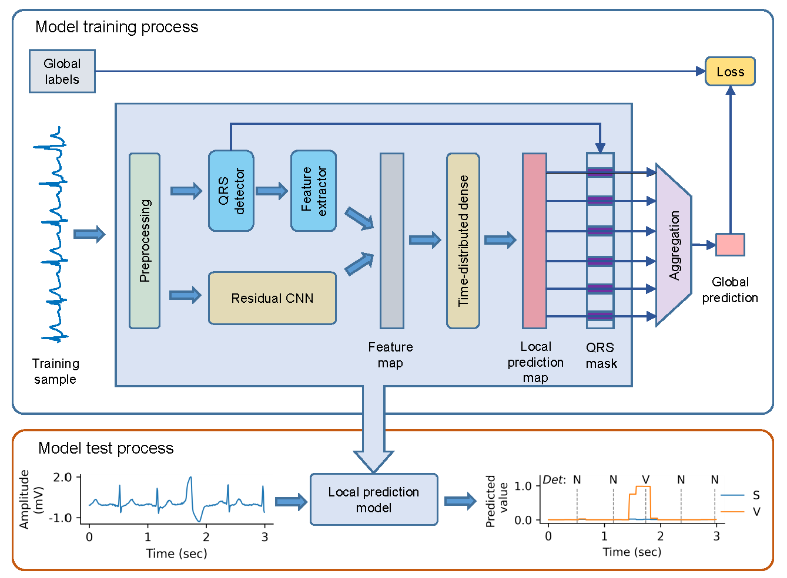

# WSL-Arrhythmia-Detection

This repository contains code for the paper:

**Weakly Supervised Arrhythmia Detection with Multilevel Prediction Fusion and RR-guided Aggregation**

Yang Liu, Qince Li, Runnan He, Yongfeng Yuan, Yong Xia, Kuanquan Wang, Henggui Zhang

School of Computer Science and Technology, Harbin Institute of Technology (HIT), Harbin, Heilongjiang, China.

**Abstract:**
Supervised deep learning has been widely used in the studies of automatic ECG classification, which largely benefits from large datasets. However, in view of time and economic cost of annotation, most of the existing large ECG datasets are coarsely annotated, where the annotations contains only the types of ECG event in a recording and not the exact time of occurrence. The exploration of methods to use these large coarsely-annotated datasets to train a fine classifier that can determine the exact occurrence time of ECG events not only helps to reduce the annotation cost, but also has the potential to improve the generalization performance of the classifier. In this paper, we propose a novel framework to detect supraventricular ectopic heartbeats (SVEB) and ventricular ectopic heartbeats (VEB) in an ECG recording based on the idea of weakly supervised learning (WSL), where the model first makes local predictions and then aggregates the local predictions to infer the existence of each event in the global scope. We analyze the challenges of WSL for arrhythmia detection, including heterogeneity of ECG features, relevance of context information and the ill-posed problem of local prediction. To address these challenges, we design novel RR-interval features extraction and enhancement methods, weighted fusion method for multi-level predictions, and RR-guided aggregation method. We use the datasets from the Physionet/CinC Challenge 2020 for model training, and MIT-BIT Arrhythmia Database for evaluation. The results show that with only weakly supervised training on the large datasets, the model achieves F1 scores of 0.8018 and 0.9058 in detecting SVEB and VEB on the MITDB respectively, which are better than their fully supervised counterparts trained on small fine-gained datasets, demonstrating the effectiveness.



## Requirements
* Python 3
* Tensorflow (version >= 2.3)
* PyWavelets (version >= 1.1)
* Scikit-learn (version >= 0.24)
* WFDB (version >= 3.2)

## Datasets
* MIT-BIH Arrhythmia Database

  Download the [dataset](https://physionet.org/content/mitdb/1.0.0/).
  
* Physionet/CinC challenge 2020 dataset

  Download the [dataset](https://physionetchallenges.org/2020/)

## Detect the QRSs and store them in files
This script just needs to be run once before the first time of model training.
```
python QRS_detection.py --cinc_path $path_of_cinc_db
```

## Fully-supervised model training and testing
 ```
python main.py --mitdb_path $path_of_mitdb \
               --testset_base_path $home_path_of_testsets \
               --supervisedMode 'SL' \
               --feature_fusion_with_rrs \
               --feature_fusion_with_entropy \
               --only_output_foreground \
               --log_file results/Fully_supervised.csv \
               --training_number 5 
```

## Weakly supervised model training and testing
* Recommended model training
```
python main.py --cinc_path $path_of_cinc_db \
               --mitdb_path $path_of_mitdb \
               --testset_base_path $home_path_of_testsets \
               --feature_fusion_with_rrs \
               --feature_fusion_with_entropy \
               --only_output_foreground \
               --log_file results/main.csv --training_number 5
```
* Ablation studies for hand-crafted features
```
# No hand-crafted feature 
python main.py --cinc_path $path_of_cinc_db \
               --mitdb_path $path_of_mitdb \
               --log_file results/no_hand_features.csv \
               --training_number 5
```
```
# with only relative RR interval
python main.py --cinc_path $path_of_cinc_db \
               --mitdb_path $path_of_mitdb \
               --feature_fusion_with_rrs \
               --log_file results/with_only_rrs.csv \
               --training_number 5
```
```
# with only RR entropy
python main.py --cinc_path $path_of_cinc_db \
               --mitdb_path $path_of_mitdb \
               --feature_fusion_with_entropy \
               --log_file results/with_only_entropy.csv \
               --training_number 5
```
* Ablation studies for prediction fusion
```
# no fusion
python main.py --cinc_path $path_of_cinc_db \
               --mitdb_path $path_of_mitdb \
               --feature_fusion_with_rrs \
               --feature_fusion_with_entropy \
               --predFusionMode 'No' \
               --log_file results/no_prediction_fusion.csv \
               --training_number 5 
```
* Ablation studies for aggregation
```
# GMP
python main.py --cinc_path $path_of_cinc_db \
               --mitdb_path $path_of_mitdb \
               --feature_fusion_with_rrs \
               --feature_fusion_with_entropy \
               --aggreg_type 'GMP' \
               --log_file results/GMP.csv \
               --training_number 5 
```
```
# GMRP
python main.py --cinc_path $path_of_cinc_db \
               --mitdb_path $path_of_mitdb \
               --feature_fusion_with_rrs \
               --feature_fusion_with_entropy \
               --aggreg_type 'GMRP' \
               --log_file results/GMRP.csv \
               --training_number 5 
```
```
# LSER r=3
python main.py --cinc_path $path_of_cinc_db \
               --mitdb_path $path_of_mitdb \
               --feature_fusion_with_rrs \
               --feature_fusion_with_entropy \
               --aggreg_type 'LSER' \
               --LSE_r 3 \
               --log_file results/LSER_r3.csv \
               --training_number 5
```
```
# LSER r=5
python main.py --cinc_path $path_of_cinc_db \
               --mitdb_path $path_of_mitdb \
               --feature_fusion_with_rrs \
               --feature_fusion_with_entropy \
               --aggreg_type 'LSER' \
               --LSE_r 5 \
               --log_file results/LSER_r5.csv \
               --training_number 5
```
```
# RRGA-solo
python main.py --cinc_path $path_of_cinc_db \
               --mitdb_path $path_of_mitdb \
               --feature_fusion_with_rrs \
               --feature_fusion_with_entropy \
               --aggreg_type 'RRguided_gmp' \
               --balance_factor 1 \
               --log_file results/RRguided_solo.csv \
               --training_number 5
```
* Ablation for FPN-based multi-level feature fusion
 ```
# with FPN-based multi-level feature fusion
python main.py --cinc_path $path_of_cinc_db \
               --mitdb_path $path_of_mitdb \
               --feature_fusion_with_rrs \
               --feature_fusion_with_entropy \
               --featureFusionMode 'FPN' \
               --log_file results/FPN_feature_fusion.csv \
               --training_number 5
```
